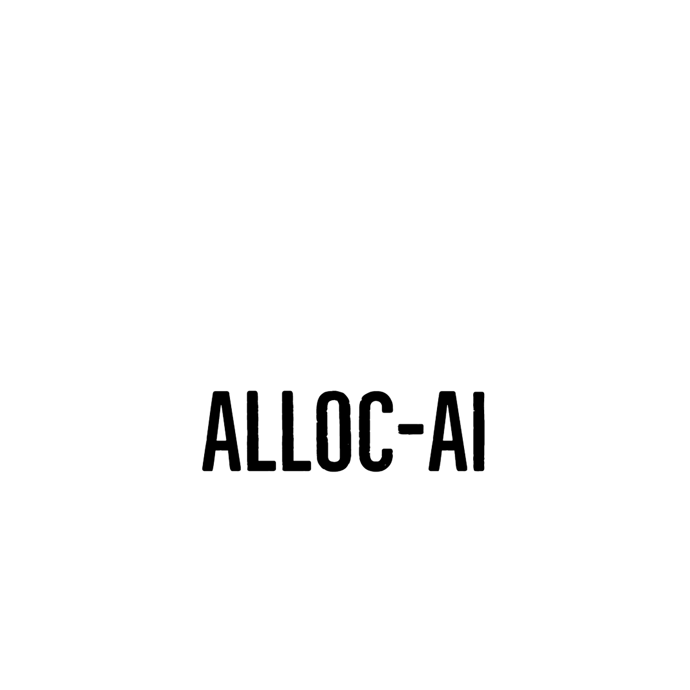

# Alloc.AI
<h1 align="center">
   
  
   
  Alloc.AI
   
</h1>

<h3 align="center">Smart Work Allocation, Seamless Results!</h3>

## About

This project was created for GTA-CodeStorm by Team Mark-10

## Tracks we are competing for
    Software-GTAST002

## Team Members:

- [Goutham C Arun](https://github.com/GouthamCArun)
- [Alfred Jimmy](https://github.com/alffy007)
- [Athul Babu](https://github.com/ATHULB04)

  <a href="#problem-helpnow-solves">Problem Statement</a> •
   <a href="#solution">Solution</a> •
  <a href="#tech-stacks-used">Tech-Stacks used</a> •
  <a href="#backend-repo">Backend Repo</a> •

  

## The Problem We Solve: Revolutionizing Work Efficiency and Collaboration, Byte by Byte.
Addressing Inefficient Work Allocation and Communication: Many businesses face difficulties in effectively assigning tasks, tracking work progress, and maintaining transparent communication among team members. This can result in missed deadlines, unclear priorities, and reduced productivity. Moreover, managers struggle to evaluate employees' performance based on incomplete or outdated information. Our solution aims to automate and optimize task allocation, provide real-time work status updates, and facilitate seamless communication, ultimately enhancing collaboration and productivity within teams."

## Solution
Our product will have the following features:

### 1. Automated Work Allocation: Algorithm-based system intelligently assigns tasks to employees based on expertise and workload.

Firebase Real-time Database will be used to store employee's task and other details.

### Instant Notifications: Real-time alerts sent to employees when tasks are assigned or updated.

Telegram will be used to implement the instant notification.This can be implemented using any platform in future

### 3. Detailed Employee Reports: Comprehensive reports generated based on work history and completion times.

ChatGPTs APIs will be used to implement the auto generated reports using continous evaluation.

### Meeting Summary Generation: Automatically creates summaries of offline/online meetings and answers related questions.

### Work Status Visibility: Managers can easily view and evaluate employees' work statuses

Overall, Our innovative solution automates work allocation, real-time notifications, and comprehensive reporting, ensuring efficient task management and streamlined communication for enhanced productivity and informed decision-making.

### Railway for Hosting
Furthermore, for hosting our project, we chose Railway. Railway is a cloud platform that simplifies the deployment and management of web applications. By utilizing Railway for hosting, we were able to easily deploy our project and make it accessible to users over the internet. Railway's user-friendly interface and seamless setup process allowed us to integrate our project with their platform effortlessly. With Railway, we benefit from reliable hosting infrastructure and automatic scaling, ensuring that our application can handle incoming traffic effectively. 
 
    
   

    
     
   

      

    
     
   

# TECH STACKS USED

<h3> 
  1.Next.js 
   
  2.ChatGPT with LangChain(for finding techstalks,summarising meetings)
   
 3.FIREBASE as Database
   
 4.Flask Rust API (Backend for API calls)
   
 5.RAILWAY
   
 6.whisper AI(for native audio transcription)
   
  
</h3>

